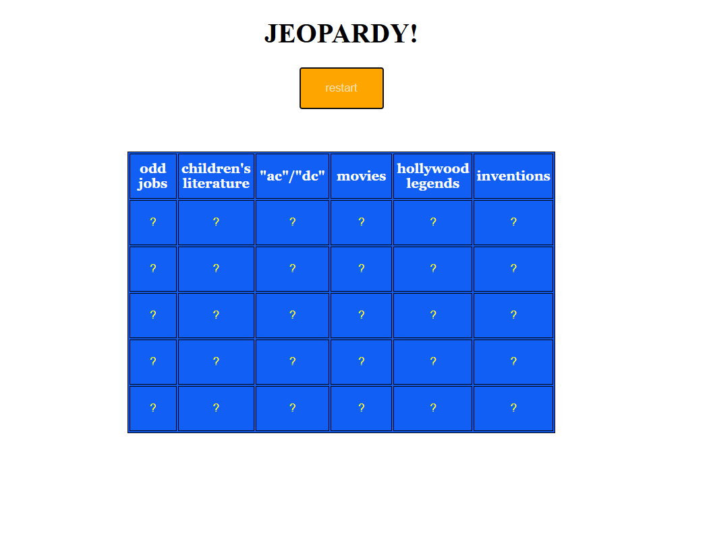

# 🎮 Jeopardy Game

A browser-based **Jeopardy game** built with HTML, CSS, and JavaScript.

This project was an important step in my web development journey because it allowed me to move beyond static HTML and CSS and start building an **interactive application that fetches and uses data from an API**.

## 🎯 About the Project

This is a simplified version of the Jeopardy game.

When the game starts, it retrieves random categories and clues from the **Jeopardy API** and dynamically creates a game board.

Players can click on a question mark to reveal the clue's question and then click again to reveal the answer.

## ✨ Features

* 🎲 Random Jeopardy categories
* 🌐 Fetches data from an external API
* 📋 Dynamically generates the game board
* ❓ Click a cell to reveal a question
* ✅ Click again to reveal the answer
* 🎨 Changes the cell color depending on its state
* 🔄 Restart functionality
* ⏳ Loading spinner styling
* 📱 Dynamic DOM manipulation

## 🛠️ Technologies Used

* HTML5
* CSS3
* JavaScript
* Axios
* REST API
* DOM Manipulation
* Async/Await

## 🌐 API

The game uses the **Rithm Jeopardy API** to retrieve categories and clues.

The application first retrieves category IDs and randomly selects six categories.

It then requests the information for each selected category and uses the returned data to build the game board.

## 🧠 How the Game Works

### 1. Get Categories

The application requests categories from the API:

```javascript
const responses = await axios.get(
  'https://rithm-jeopardy.herokuapp.com/api/categories?count=100'
);
```

The category IDs are then stored and shuffled.

### 2. Select Random Categories

Six random categories are selected from the available categories.

### 3. Get Category Data

For each selected category, another API request retrieves its title and clues.

```javascript
const category = await axios.get(
  `https://rithm-jeopardy.herokuapp.com/api/category?id=${catId}`
);
```

### 4. Build the Game Board

JavaScript dynamically creates the table, categories, rows, cells, and question buttons.

### 5. Reveal Questions and Answers

Each clue has a `showing` property that keeps track of its current state:

```text
null → question → answer
```

When the player clicks a clue:

* The first click displays the question.
* The second click displays the answer.
* Additional clicks are ignored.

## 📚 What I Learned

This project helped me move from basic HTML and CSS into JavaScript development.

### JavaScript

I practiced:

* Variables and arrays
* Objects
* Functions
* Arrow functions
* Array methods such as `map`, `forEach`, and `slice`
* Conditional statements
* Event listeners
* DOM manipulation
* Creating HTML elements dynamically
* Modifying element properties and styles

### Asynchronous JavaScript

I also learned how to work with asynchronous operations using:

* Promises
* `async` / `await`
* API requests
* `Promise.all()`
* Error handling with `try...catch`

### APIs

One of the biggest things I learned from this project was how to work with an external API.

Instead of hard-coding all of the Jeopardy questions, the application retrieves the data from the API and uses it to generate the game dynamically.

### CSS

I continued practicing CSS by:

* Creating a game-board layout
* Using Flexbox
* Styling buttons
* Styling tables
* Creating a loading spinner
* Using CSS animations
* Using `@keyframes`
* Changing styles dynamically with JavaScript

## 📈 My Progress

This project represents an important stage in my development as a programmer.

My earlier projects focused mainly on **HTML and CSS**, while this project introduced me to **JavaScript and interacting with external data**.

Through this project, I started learning how to turn a static webpage into an interactive application.

My progression so far:

```text
HTML
  ↓
HTML + CSS
  ↓
JavaScript
  ↓
DOM Manipulation
  ↓
APIs & Async JavaScript
  ↓
Interactive Applications
```

## 🚧 Future Improvements

There are several things I would like to improve as I continue learning:

* Add a proper loading state while API data is being retrieved
* Improve the restart functionality
* Add scoring
* Add player controls
* Improve the responsive design
* Improve error handling
* Add animations when questions and answers are revealed
* Prevent duplicate event listeners when restarting the game
* Improve the overall visual design
* Refactor the code into smaller, reusable functions

## 📸 Screenshot



## 🚀 Project Status

This project is a learning project and represents one of the steps in my journey from learning basic HTML and CSS to building interactive web applications with JavaScript.

I plan to continue improving this project as I learn more about JavaScript and modern web development.

---

**Built with HTML, CSS & JavaScript 🎮**
